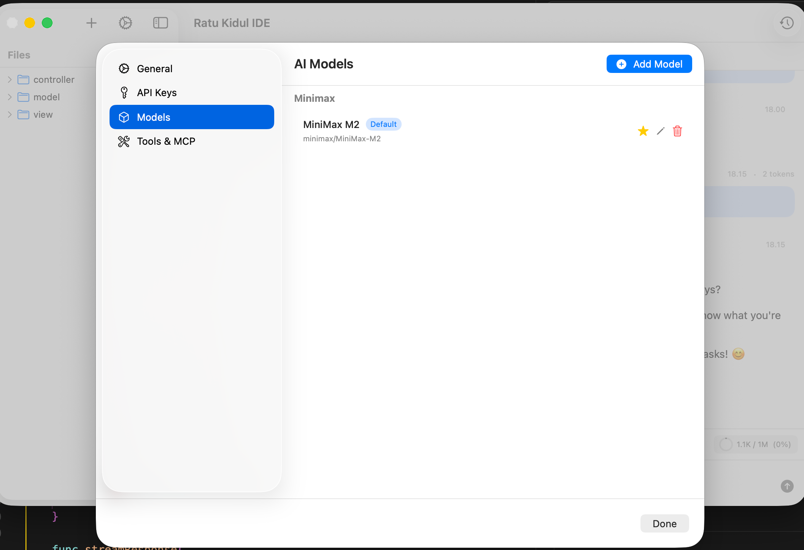

# Ratu Kidul IDE

A native macOS AI-powered development environment built with SwiftUI.

[](https://github.com/madebyaris/ratu-kidul-ide)



## Features

- **Multi-Model Chat**: Query multiple AI models simultaneously with tabbed interface
- **Bring Your Own Key (BYOK)**: Use your own API keys stored securely in macOS Keychain
- **Custom API Endpoints**: Support for OpenAI/Anthropic compatible APIs with custom base URLs
- **Performance Optimized**: 
  - Ultra-lightweight memory footprint (50-120MB RAM usage)
  - Lazy loading for chat messages (loads last 2-3 messages initially)
  - Optimized context calculation (only recalculates on send and after response)
  - Memory-efficient pagination with "load more" functionality
- **Customizable UI**:
  - Adjustable font sizes for editor, chat, and system-wide elements
  - Expandable/collapsible AI responses for long messages
  - Auto-scroll to latest messages on chat load
- **Advanced Code Editor**: Powered by CodeEdit with tree-sitter syntax highlighting
- **Keyboard Shortcuts**: Save (⌘+S), Search (⌘+F), Close Tab (⌘+W), New Chat (⌘+N), and more
- **Native Performance**: Built with SwiftUI for optimal macOS performance
- **Git-Optional**: Works with or without git repositories

## Screenshots


The IDE features a clean, modern interface with tabbed editing, sidebar navigation, and an integrated AI chat interface.

## App Icon


## Requirements

- macOS 15.0 (Tahoe) or later
- Xcode 15.0 or later
- Swift 5.9 or later

## Building

### Option 1: Using XcodeGen (Recommended)

1. Install XcodeGen if you haven't already:
   ```bash
   brew install xcodegen
   ```

2. Generate the Xcode project:
   ```bash
   xcodegen generate
   ```

3. Open the generated project:
   ```bash
   open RatuKidulIDE.xcodeproj
   ```

### Option 2: Using Swift Package Manager

1. Open Package.swift in Xcode:
   ```bash
   open Package.swift
   ```

2. Xcode will create a temporary project. For a permanent project, use Option 1.

### Option 3: Manual Xcode Project

1. Create a new macOS App project in Xcode
2. Add all files from the `RatuKidulIDE` folder
3. Configure the bundle identifier to `sh.ratukidul.ide`
4. Set deployment target to macOS 15.0 (Tahoe)
5. Add the entitlements file to the project
6. Resolve Swift Package Manager dependencies

## Project Structure

```
RatuKidulIDE/
├── App/              # App entry point and lifecycle
├── Features/         # Feature modules (Chat, Settings, etc.)
├── Core/            # Core services and providers
├── Data/            # SwiftData models
├── Shared/          # Shared components and utilities
└── Resources/       # Assets and configuration files
```

## Configuration

1. Launch the app
2. Go to Settings → API Keys
3. Enter your API keys for supported providers (OpenAI, Anthropic, Google, MiniMax, Grok, OpenRouter, Perplexity, Ollama, LM Studio)
4. Keys are stored securely in macOS Keychain

### Adding Custom Models

1. Go to Settings → Models
2. Click "Add Model"
3. Select a provider (including "OpenAI Compatible" or "Anthropic Compatible" for custom APIs)
4. For compatible providers, you can enter a custom API base URL
5. Configure model ID, display name, context window, and optional system prompt
6. Save your model configuration

## Development Status

### Completed Features

- ✅ SwiftData models for projects, chats, messages, and model configurations
- ✅ Multiple AI providers with streaming support:
  - OpenAI
  - Anthropic (Claude)
  - Google (Gemini)
  - MiniMax
  - Grok (xAI)
  - OpenRouter
  - Perplexity
  - Ollama (local)
  - LM Studio (local)
  - OpenAI Compatible (custom endpoints)
  - Anthropic Compatible (custom endpoints)
- ✅ Tabbed editor interface (VS Code-style)
- ✅ Advanced code editor with syntax highlighting (CodeEdit)
- ✅ Chat interface with:
  - Lazy loading and pagination
  - Expandable/collapsible long responses
  - Auto-scroll to latest messages
  - Context window tracking
  - Multi-model responses
- ✅ Keyboard shortcuts (Save, Search, Close Tab, New Chat, etc.)
- ✅ Font size customization (editor, chat, system-wide)
- ✅ Keychain integration for secure API key storage
- ✅ Settings UI with model management
- ✅ Custom API endpoint support for compatible providers
- ✅ Context calculation optimization
- ✅ Project and file management

### Planned Features

- **MCP (Model Context Protocol) Integration**: Full support for MCP tools and servers
- **Attachments via MCP**: MiniMax Coding plan integration for enhanced file and code context handling
- **Tool Agent**: AI-powered tool calling and execution capabilities
- Git integration
- Terminal integration

## About

**Ratu Kidul IDE** is an AI-powered development environment built with native SwiftUI for macOS, providing a seamless coding experience with integrated AI assistance.

### Author

**Aris Setiawan**  
Dev Expert Community at [MiniMax](https://www.minimax.io)

- 🌐 Website: [madebyaris.com](https://madebyaris.com)
- 💻 GitHub: [@madebyaris](https://github.com/madebyaris)
- 📦 Repository: [ratu-kidul-ide](https://github.com/madebyaris/ratu-kidul-ide)

## License

MIT

